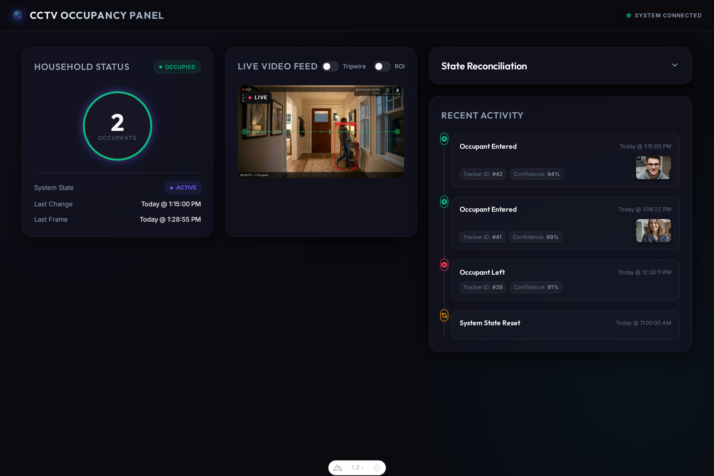
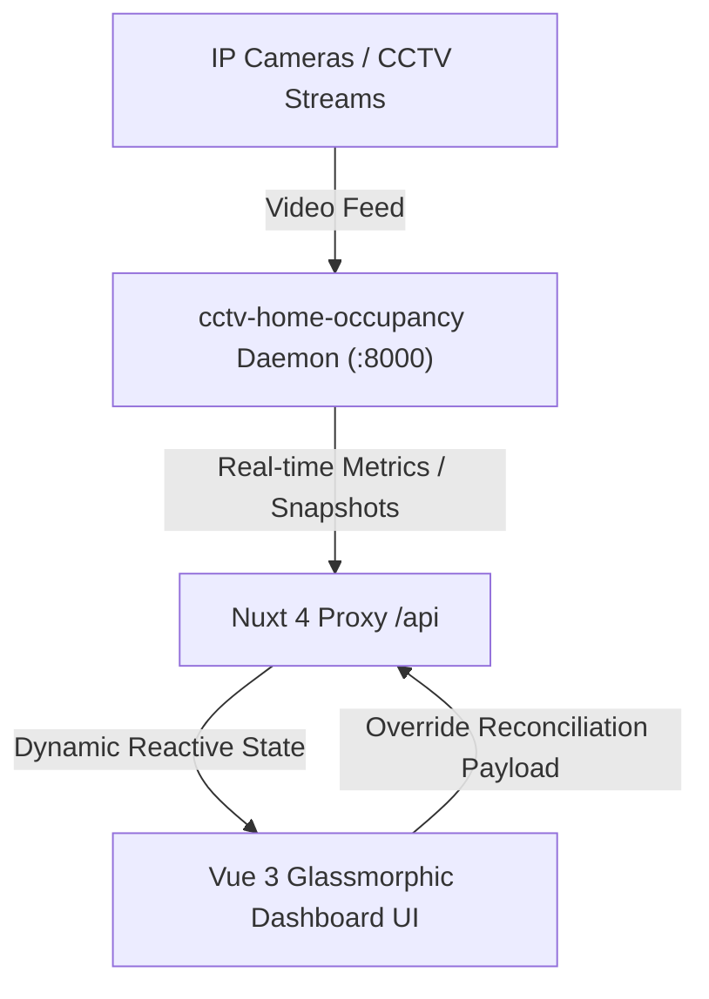

# 👁️ CCTV Home Occupancy Panel

A high-performance, real-time presence monitoring and occupancy reconciliation dashboard designed **exclusively** as a companion for the [mrazza/cctv-home-occupancy](https://github.com/mrazza/cctv-home-occupancy) project.



This dashboard is not designed for general-purpose smart security systems; instead, it integrates specifically with the `mrazza/cctv-home-occupancy` Python daemon to display its occupancy levels, event logs, and security tripwire snapshots within a premium glassmorphic user interface.

---

## 🌟 Key Features

* **Real-Time Occupancy Analytics**: Visual status indicators displaying current occupant count, presence state (Occupied vs. Vacant), and live frame processing stats.
* **Manual State Reconciliation**: An interactive, collapsible dashboard module enabling administrators to forcefully override or calibrate occupancy counts if computer vision tracking falls out of sync (with glassmorphic modal confirmation flows).
* **Activity & Motion Timeline**: A chronologically sorted event logger showcasing tripwire entries/exits, movement tracking windows, and timestamps.
* **Snapshot Lightbox Inspector**: Direct integration with tripwire events to view, zoom, and inspect captured high-definition CCTV security snapshots.
* **Resilient Offline Detection**: Immediate UI failover triggers and visual status indicators if the underlying `mrazza/cctv-home-occupancy` daemon goes offline or is unreachable.
* **Sleek Glassmorphism Design System**: Tailored from scratch using pure CSS variables, custom typography, backdrop-filters, subtle gradients, and reactive micro-animations.

---

## 🏗️ Technical Architecture

This application is built as a highly decoupled Nuxt 4 web app that proxies data dynamically to the `mrazza/cctv-home-occupancy` Python daemon.



### Stack Components:
* **Framework**: [Nuxt 4](https://nuxt.com/) (Vue 3, Composition API with `<script setup>`).
* **Styling Engine**: Pure CSS Variable Design Tokens (Dark-mode, cyber-themed glassmorphism).
* **Runtime Server**: Nitro Node.js Engine (with dynamic CORS proxy routing).
* **Testing Suite**: [Vitest](https://vitest.dev/) with Vue Test Utils and Happy DOM.

---

## ⚙️ Environment Configuration

The dashboard uses runtime variables that can be overridden in production or defined locally in a `.env` file at the root:

```ini
# Remote CCTV home occupancy API base URL (CORS proxy target)
NUXT_API_BASE_URL=http://localhost:8000

# Front-end dashboard top-left header title override
NUXT_PUBLIC_PANEL_TITLE="CCTV OCCUPANCY PANEL"
```

---

## 🚀 Getting Started

### 1. Prerequisites
Ensure you have **Node.js (v18.x or later)** installed.

### 2. Install Dependencies
```bash
npm install
```

### 3. Run in Development Mode
Start the local server. The Nuxt H3 server handles backend proxy routing automatically.
```bash
npm run dev
```
Open **`http://localhost:3000`** in your browser.

### 4. Build and Preview for Production
Generate a production bundle optimized for high-speed serving:
```bash
# Build the application
npm run build

# Preview the production build locally
npm run preview
```

---

## 🧪 Testing

The codebase includes an extensive suite of component unit tests and system integration tests to guarantee reliability.

### Run All Unit Tests
```bash
npm run test
```

### Run Coverage Reports
Generates a highly detailed, file-by-file visual code coverage report:
```bash
npm run test:coverage
```
*Coverage reports will be output to the `/coverage` directory (configured to be ignored in git).*

---

## 🔗 Integrated API Contracts

The Nuxt backend proxies these endpoints directly to the `mrazza/cctv-home-occupancy` companion daemon:

### 1. Status Check
* **Endpoint**: `GET /api/status`
* **Purpose**: Fetches current household occupancy state, occupant totals, and hardware diagnostic statuses.
* **Payload Structure**:
  ```json
  {
    "is_someone_home": true,
    "current_occupancy": 2,
    "system_state": "CONNECTED",
    "last_updated": "2026-05-30T03:52:12Z",
    "last_processed_frame": "2026-05-30T03:52:11Z"
  }
  ```

### 2. Activity Events Log
* **Endpoint**: `GET /api/events?limit=10`
* **Purpose**: Pulls list of timeline events, tripwire crossings, and security snapshots.
* **Payload Structure**:
  ```json
  [
    {
      "id": "evt_9831a2",
      "timestamp": "2026-05-30T03:51:00Z",
      "type": "entry",
      "message": "Occupant entered via East gate tripwire.",
      "snapshot_url": "/api/snapshots/evt_9831a2.jpg"
    }
  ]
  ```

### 3. State Reconciliation / Reset
* **Endpoint**: `POST /api/reset`
* **Purpose**: Forces tracker state alignment when occupants bypass tripwires together.
* **Payload Structure**:
  ```json
  {
    "is_someone_home": true,
    "current_occupancy": 3
  }
  ```
